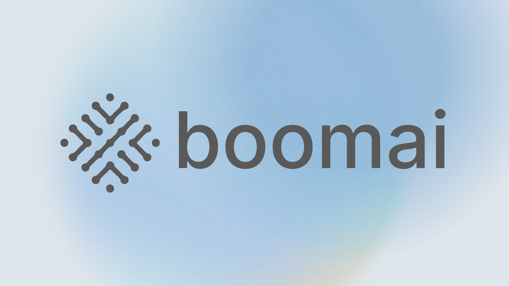

# Contributor Code of Conduct

This has quickly turned into a passion project for me and I want it to be a safe space for other developers to add and most importantly learn. We are shipping a tiered toolchain (deterministic stubs + Maker voting tool), so please keep discussions and changes constructive, safety-minded, and respectful when touching shared tooling.

## Expectations
- Be respectful, constructive, and patient.
- Assume good intent; ask for clarification instead of jumping to conclusions.
- Keep feedback actionable and specific.

## Unacceptable Behavior
- Harassment, hate speech, or discrimination.
- Personal attacks or sustained disruption.
- Publishing others’ private information without consent.

## Reporting
- Email: security@boomai.dev
- Or open a private Security Advisory on GitHub.

I’ll review reports promptly and keep them confidential. Serious or repeated violations can lead to temporary or permanent restrictions.

